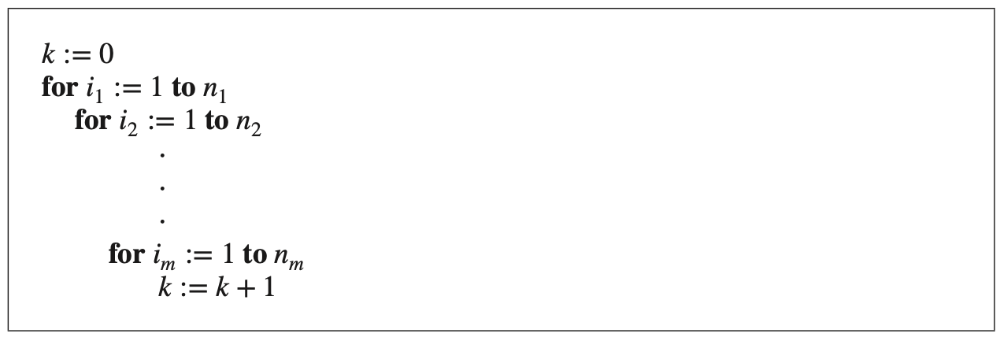

# Counting and Combinatorics

Source: Rosen Book 

---

## Q001

[NAT]

A new company with just two employees, Sanchez and Patel, rents a floor of a building with 12 offices. How many ways are there to assign different offices to these two employees?

**Answer:** $12 * 11$

---

## Q002

[NAT]

The chairs of an auditorium are to be labeled with an uppercase English letter followed by a positive integer not exceeding 100. What is the largest number of chairs that can be labeled differently?

**Answer:** $26 * 100$

---

## Q003

[NAT]

There are 32 computers in a data center in the cloud. Each of these computers has 24 ports. How many different computer ports are there in this data center?

**Answer:** $32 * 24$

---
## Q004

[NAT]

How many different bit strings of length seven are there?

**Answer:** $2^7$

---
## Q005

[NAT]

How many different license plates can be made if each plate contains a sequence of three uppercase English letters followed by three digits (and no sequences of letters are prohibited, even if they are obscene)?

**Answer:** $ 26* 26* 26* 10* 10* 10 $

---
## Q006

[NAT]

**Counting Functions** How many functions are there from a set with m elements to a set with n elements?

**Answer:** $n^m$

---
## Q007

[NAT]

**Counting One-to-One Functions** How many one-to-one functions are there from a set with m elements to one with n elements? Assume m<=n

**Answer:** $n (n-1)(n- 2)⋯ (n- m + 1)$

---
## Q008

[NAT]

What is the value of $k$ after the following code, where $n1, n2, … , nm$ are positive integers, has been executed?

**Answer:** $n1 * n2 * n3 ⋯ * nm$

---

## Q009

[NAT]

**Counting Subsets of a Finite Set** How many number of different subsets of a finite set $S$.

**Answer:** \(2^{|S|}\)

---

